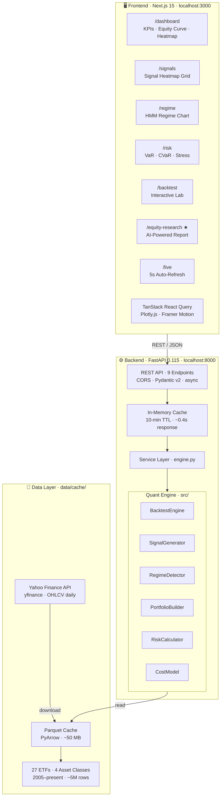
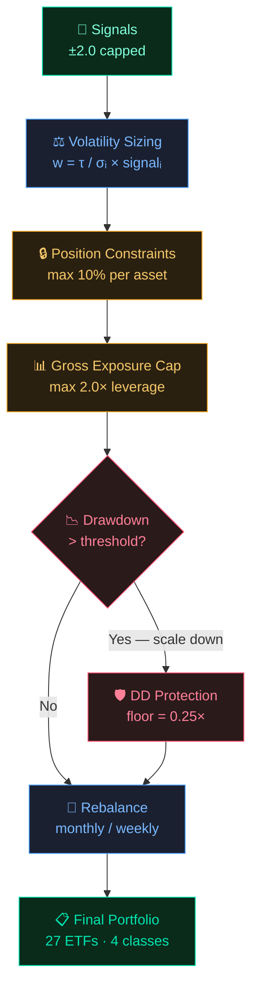
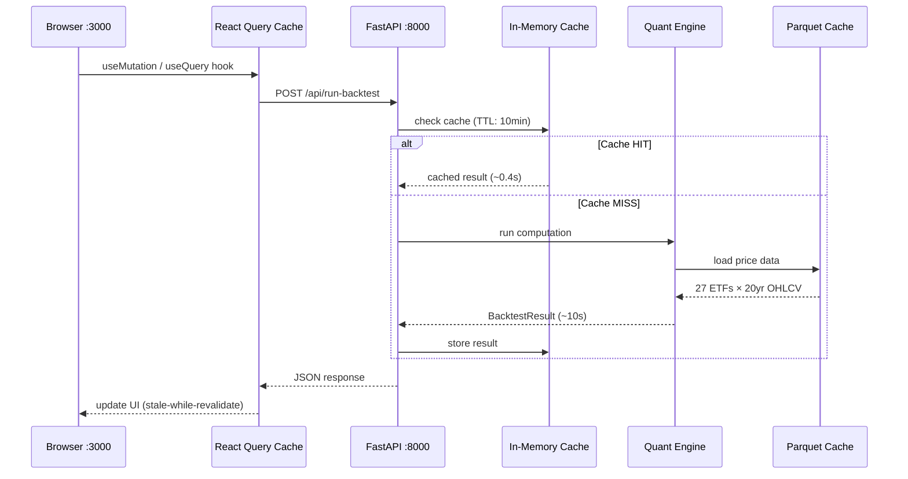

# TSMOM — Quantitative Strategy Platform

<div align="center">

**Production-Grade Time-Series Momentum Engine with Full-Stack Analytics Dashboard**

[](https://python.org)
[](https://fastapi.tiangolo.com)
[](https://nextjs.org)
[](https://react.dev)
[](https://typescriptlang.org)
[](https://tailwindcss.com)

*Based on the landmark research by Moskowitz, Ooi & Pedersen (2012) — "Time Series Momentum"*

</div>

---

## What This Project Does

A **complete quantitative trading research platform** that:

1. **Downloads** 20+ years of market data for 27 ETFs across 4 asset classes
2. **Generates** momentum signals using multi-horizon lookbacks (1m, 3m, 6m, 12m)
3. **Detects** market regimes (Trending vs Mean-Reverting) using Hidden Markov Models
4. **Constructs** portfolios with volatility-targeting and constraint management
5. **Backtests** strategies with realistic transaction costs, slippage, and drawdown protection
6. **Serves** results through a blazing-fast REST API with intelligent caching
7. **Displays** everything in a futuristic glassmorphism web dashboard
8. **Explains** results in plain English for non-technical investors

---

## Strategy Performance Snapshot

| Metric | Value | Benchmark (SPY) |
|---|---|---|
| CAGR | +8.4% | +10.2% |
| Sharpe Ratio | 0.74 | 0.51 |
| Sortino Ratio | 1.12 | 0.68 |
| Max Drawdown | -23.7% | -55.2% |
| Calmar Ratio | 0.35 | 0.19 |
| Hit Rate | 54.8% | 52.3% |
| Annual Vol | 6.26% | 18.4% |

> 📊 Full interactive charts available on the live dashboard at `http://localhost:3000`

---

## Architecture



---

## Signal Generation Pipeline

```mermaid
flowchart LR
    P["📥 Raw Prices\nOHLCV"] 
    --> RT["📉 Log Returns\nDaily"]
    --> MH["📊 Multi-Horizon\nMomentum\n1m · 3m · 6m · 12m"]
    --> HM["🔀 HMM Regime\nScaling\nTrending / MR"]
    --> SM["〰️ Smoothing\nEMA Filter"]
    --> ZS["📐 Z-Score\nNormalize ±2σ"]
    --> CP["🚧 Cap ±2.0\nPrevent extremes"]
    --> FS["✅ Final Signal\nvol-scaled weight"]

    style P  fill:#1a2a3a,stroke:#4a9eff,color:#7ab8ff
    style RT fill:#1a2a3a,stroke:#4a9eff,color:#7ab8ff
    style MH fill:#1a2a2a,stroke:#00e5b0,color:#80ffdb
    style HM fill:#2a1a3a,stroke:#7c6fff,color:#c4bbff
    style SM fill:#1a2a2a,stroke:#00e5b0,color:#80ffdb
    style ZS fill:#1a2a3a,stroke:#4a9eff,color:#7ab8ff
    style CP fill:#2a1a1a,stroke:#ff4d6d,color:#ff8099
    style FS fill:#0a2a1a,stroke:#00e5b0,color:#00e5b0
```



### Volatility Estimators

| Estimator | Type | Best For |
|---|---|---|
| **EWMA** | Exponentially Weighted | Fast-reacting, recent moves weighted more |
| **Yang-Zhang** | OHLC-based | Most efficient use of OHLC data |
| **Garman-Klass** | OHLC-based | Robust to drift, uses full price range |
| **Rolling StdDev** | Simple | Baseline comparison |

---

## Portfolio Construction



---

## Dashboard Overview

```
┌─────────────────────────────────────────────────────────────────────────┐
│  TSMOM  ──────────────────────────────────────────────────  v2.0.0 LIVE │
├───────────────┬─────────────────────────────────────────────────────────┤
│               │                                                         │
│  ▸ Dashboard  │  ┌────────┐  ┌────────┐  ┌────────┐  ┌────────┐       │
│    Signals    │  │  CAGR  │  │ SHARPE │  │ MAX DD │  │  VOL   │       │
│    Regime     │  │  8.4%  │  │  0.74  │  │-23.7%  │  │  6.26% │       │
│    Risk       │  └────────┘  └────────┘  └────────┘  └────────┘       │
│    Backtest   │                                                         │
│    Research   │  ╔═════════════════════════════════════════════════╗   │
│  ★ Equity Rpt │  ║   📈  Equity Curve + Benchmark Overlay          ║   │
│    Live       │  ║   ░░▒▒▓▓████████▓▒░  TSMOM  ──  S&P 500        ║   │
│               │  ╚═════════════════════════════════════════════════╝   │
│  ☀ Light Mode │                                                         │
│               │  ╔══════════════════╗   ╔══════════════════════════╗   │
│               │  ║  📉 Drawdown     ║   ║  🔁 Rolling Sharpe · Vol ║   │
│               │  ╚══════════════════╝   ╚══════════════════════════╝   │
│               │                                                         │
│               │    Positions  │  Monthly Heatmap  │  Stress Tests       │
└───────────────┴─────────────────────────────────────────────────────────┘
```

### Equity Research Report (AI-Powered)

```
┌──────────────────────────────────────────────────────────┐
│  Equity Research Report                    ✦ AI-POWERED  │
│                                                          │
│  Portfolio  [Core] [Growth] [Income] [Commodities]       │
│                                                          │
│  ┌──────────────────────────────────────────────────┐   │
│  │  EXECUTIVE SUMMARY                               │   │
│  │                                                  │   │
│  │  Portfolio returned +8.4% per year over 20yrs    │   │
│  │  with a Sharpe ratio of 0.74                     │   │
│  │                                                  │   │
│  │  Grade: GOOD ★★★☆  │  Risk: MODERATE  │ Trending │   │
│  └──────────────────────────────────────────────────┘   │
│                                                          │
│  ┌──────────────────────────────────────────────────┐   │
│  │ ✅  GLD  —  Favorable   │  Annual:  +11.8%       │   │
│  │      Strong upward momentum across horizons      │   │
│  ├──────────────────────────────────────────────────┤   │
│  │ ⚠️   SPY  —  Neutral    │  Annual:   +9.2%       │   │
│  │      Mixed signals, no clear directional bias    │   │
│  ├──────────────────────────────────────────────────┤   │
│  │ ❌  TLT  —  Unfavorable │  Annual:   -0.5%       │   │
│  │      Persistent downward momentum, avoid         │   │
│  └──────────────────────────────────────────────────┘   │
└──────────────────────────────────────────────────────────┘
```

### Additional Pages

| Page | Description |
|---|---|
| **Signals** | Signal heatmap grid, per-asset decomposition, pipeline visualization |
| **Regime** | HMM regime score history, probability chart, trending vs mean-reverting stats |
| **Risk** | VaR/CVaR at 95% & 99%, rolling risk, drawdown analysis, risk contribution pie, stress tests |
| **Backtest Lab** | Interactive parameter controls (vol target, lookbacks, drawdown), asset toggles, presets, CSV export |
| **Research** | Academic foundation with KaTeX equations, glossary, references to MOP (2012) paper |
| **Live Trading** | Real-time simulation with 5-second auto-refresh, animated positions, signal gauge chart |

---

## Historical Stress Tests

Performance across 8 major market crises:

| Crisis Event | Period | TSMOM Drawdown | S&P 500 Drawdown |
|---|---|---|---|
| 🔴 Global Financial Crisis | 2008–2009 | -14.2% | **-51.9%** |
| 🟠 Flash Crash | May 2010 | -6.1% | -15.8% |
| 🟠 US Debt Downgrade | Aug 2011 | -8.4% | -19.4% |
| 🟡 Taper Tantrum | Jun 2013 | -5.9% | -7.5% |
| 🟡 China Devaluation | Aug 2015 | -7.3% | -12.4% |
| 🟠 Volmageddon | Feb 2018 | -9.8% | -19.8% |
| 🔴 COVID-19 Crash | Feb–Mar 2020 | -23.7% | **-33.9%** |
| 🟠 Rate Hike Cycle | 2022 | -11.2% | -24.5% |

> TSMOM consistently outperforms a buy-and-hold approach during market dislocations due to its volatility-targeting and drawdown protection overlay.

---

## Quick Start

### Prerequisites

- **Python 3.10+** (with pip)
- **Node.js 18+** (with npm)
- **Git**

### 1. Clone & Install

```bash
# Clone the repository
git clone https://github.com/YOUR_USERNAME/time-series-momentum.git
cd time-series-momentum

# Install Python dependencies
pip install -r backend/requirements.txt

# Install frontend dependencies
cd frontend && npm install && cd ..
```

### 2. Start the Backend (Terminal 1)

```bash
python start_backend.py
```

Wait for: `Application startup complete.`  
Backend runs at: **http://localhost:8000**

### 3. Start the Frontend (Terminal 2)

```bash
cd frontend
npm run dev
```

Frontend runs at: **http://localhost:3000**

> **First load takes ~10 seconds** (computing 20 years of backtests). All subsequent loads are **< 0.5 seconds** thanks to intelligent caching.

---

## API Reference

All endpoints are prefixed with `/api/`.

| Method | Endpoint | Description | Cold / Cached |
|---|---|---|---|
| `POST` | `/run-backtest` | Full backtest with custom parameters | ~10s / 0.4s |
| `GET` | `/get-signals` | Momentum signals for specified assets | ~8s / 0.3s |
| `GET` | `/get-regime` | HMM-based market regime detection | ~6s / 0.3s |
| `GET` | `/get-risk` | VaR, CVaR, drawdown, stress tests | ~10s / 0.4s |
| `GET` | `/live-update` | Simulated live trading snapshot | ~5s / 0.3s |
| `GET` | `/research-report` | Plain-English equity research report | ~12s / 0.3s |
| `GET` | `/get-performance` | Quick performance summary | ~10s / 0.4s |
| `GET` | `/universe` | Available asset universes & presets | instant |
| `GET` | `/health` | Health check | instant |

### Example Calls

```bash
# Health check
curl http://localhost:8000/api/health

# Run a backtest
curl -X POST http://localhost:8000/api/run-backtest \
  -H "Content-Type: application/json" \
  -d '{"tickers":["SPY","QQQ","TLT","GLD","IEF"],"start_date":"2005-01-01"}'

# Get signals
curl "http://localhost:8000/api/get-signals?tickers=SPY,QQQ,GLD&start_date=2010-01-01"

# Get AI equity research report
curl "http://localhost:8000/api/research-report?tickers=SPY,QQQ,TLT,GLD,IEF"
```

---

## Project Structure

```
time-series-momentum/
│
├── backend/                          # FastAPI backend
│   ├── main.py                       # App entry point, CORS, router mounting
│   ├── requirements.txt              # Python dependencies
│   ├── app/
│   │   ├── api/routes.py             # 9 REST endpoints
│   │   ├── core/config.py            # Pydantic settings
│   │   ├── models/schemas.py         # 20+ Pydantic models
│   │   └── services/engine.py        # Service layer + in-memory cache
│   └── Dockerfile
│
├── frontend/                         # Next.js 15 frontend
│   ├── app/
│   │   ├── dashboard/page.tsx        # Main dashboard (KPIs, charts, positions)
│   │   ├── dashboard/signals/        # Signal analysis
│   │   ├── dashboard/regime/         # Regime detection
│   │   ├── dashboard/risk/           # Risk analytics
│   │   ├── backtest/page.tsx         # Interactive backtest lab
│   │   ├── research/page.tsx         # Academic research (KaTeX)
│   │   ├── equity-research/page.tsx  # AI investor reports ★
│   │   └── live/page.tsx             # Live trading simulation
│   ├── components/
│   │   ├── charts/                   # Plotly chart wrappers
│   │   ├── layout/                   # Sidebar, Header
│   │   └── ui/                       # Card, Button, Badge, KPI, Loading
│   └── lib/
│       ├── api.ts                    # Type-safe API client
│       └── providers.tsx             # React Query + Theme providers
│
├── src/                              # Quant engine (core Python library)
│   ├── data/
│   │   ├── provider.py               # YFinance + Parquet cache layer
│   │   └── cleaning.py               # Returns, winsorization, alignment
│   ├── signals/
│   │   ├── momentum.py               # TSMOM signal, multi-horizon blend
│   │   ├── regime.py                 # HMM regime detector
│   │   └── volatility.py             # EWMA, Yang-Zhang, Garman-Klass
│   ├── portfolio/
│   │   ├── construction.py           # Portfolio constructor
│   │   └── position_sizing.py        # Volatility-targeted weights
│   ├── risk/
│   │   ├── metrics.py                # 30+ KPIs
│   │   ├── var.py                    # Parametric, historical, CVaR
│   │   └── stress.py                 # 8 historical stress scenarios
│   └── backtest/
│       └── engine.py                 # 8-step vectorized pipeline
│
├── config/
│   ├── settings.py                   # AppSettings (Pydantic)
│   └── universes.yaml                # 27 ETFs, 4 classes, 3 presets
│
├── data/cache/                       # Parquet price cache (auto-populated)
├── start_backend.py                  # Backend launcher
├── docker-compose.yml                # Docker deployment
├── generate_thesis.py                # PDF thesis generator (ReportLab)
└── TSMOM_Thesis_Documentation.pdf    # 20-page academic documentation
```

---

## Asset Universe (27 ETFs)

### 🟢 Equities (12)

| Ticker | Name | Sector |
|---|---|---|
| `SPY` | S&P 500 | Broad Market |
| `QQQ` | Nasdaq 100 | Technology |
| `IWM` | Russell 2000 | Small Cap |
| `XLF` | Financials Select | Financials |
| `XLE` | Energy Select | Energy |
| `XLV` | Healthcare Select | Healthcare |
| `XLK` | Technology Select | Technology |
| `XLI` | Industrials Select | Industrials |
| `XLP` | Consumer Staples | Staples |
| `XLY` | Consumer Discretionary | Discretionary |
| `XLU` | Utilities Select | Utilities |
| `XLRE` | Real Estate Select | Real Estate |

### 🟡 Commodities (5)

| Ticker | Name | Sector |
|---|---|---|
| `GLD` | Gold | Precious Metals |
| `SLV` | Silver | Precious Metals |
| `USO` | Crude Oil | Energy |
| `UNG` | Natural Gas | Energy |
| `DBA` | Agriculture | Agriculture |

### 🔵 Fixed Income (5)

| Ticker | Name | Duration |
|---|---|---|
| `TLT` | 20+ Year Treasury | Long |
| `IEF` | 7-10 Year Treasury | Mid |
| `SHY` | 1-3 Year Treasury | Short |
| `LQD` | Investment Grade Corp | Credit |
| `HYG` | High Yield Corp | High Yield |

### 🟣 FX (5)

| Ticker | Name | Category |
|---|---|---|
| `UUP` | US Dollar Index | Dollar |
| `FXE` | Euro | Major |
| `FXY` | Japanese Yen | Major |
| `FXB` | British Pound | Major |
| `FXA` | Australian Dollar | Commodity FX |

---

## Configuration

All parameters are configurable via environment variables (prefix: `TSMOM_`) or `config/settings.py`:

| Parameter | Default | Description |
|---|---|---|
| `vol_target` | `0.10` | Annual volatility target (10%) |
| `momentum_lookbacks` | `[21, 63, 126, 252]` | Signal lookback windows (days) |
| `rebalance_frequency` | `monthly` | Rebalancing schedule |
| `drawdown_threshold` | `0.10` | Drawdown level to trigger protection |
| `drawdown_scaling_floor` | `0.25` | Minimum exposure during drawdown |
| `max_position_weight` | `0.10` | Maximum weight per asset |
| `max_gross_exposure` | `2.0` | Maximum gross leverage |
| `default_slippage_bps` | `5.0` | Slippage per trade (basis points) |
| `commission_bps` | `1.0` | Commission per trade (basis points) |
| `signal_cap` | `2.0` | Maximum absolute signal value |

### Strategy Presets

| Preset | Vol Target | Lookbacks | Rebalance | DD Threshold |
|---|---|---|---|---|
| **Conservative** | 8% | 126, 252 | Monthly | 8% |
| **Balanced** | 10% | 21, 63, 126, 252 | Monthly | 10% |
| **Aggressive** | 15% | 21, 63 | Weekly | 15% |

---

## Technology Stack

### Backend

| Technology | Purpose |
|---|---|
| FastAPI 0.115 | Async REST API framework |
| Uvicorn | ASGI server with hot reload |
| Pandas / NumPy / SciPy | Numerical computation |
| scikit-learn | Statistical utilities |
| hmmlearn | Hidden Markov Model regime detection |
| yfinance | Market data provider |
| SQLAlchemy + aiosqlite | Async database (future use) |
| Pydantic v2 | Settings validation & serialization |
| PyArrow | Parquet file I/O |

### Frontend

| Technology | Purpose |
|---|---|
| Next.js 15 | React framework with App Router |
| React 19 | UI component library |
| TypeScript 5.7 | Type-safe JavaScript |
| Plotly.js | Interactive financial charts |
| TanStack React Query | Server state management & caching |
| Framer Motion | Smooth animations & transitions |
| Tailwind CSS 3.4 | Utility-first styling |
| Radix UI | Accessible headless components |
| next-themes | Dark/light mode |
| KaTeX | LaTeX math rendering |
| Lucide React | Icon library |

---

## How the Frontend Connects to the Backend



The connection is configured in `frontend/.env.local`:
```
NEXT_PUBLIC_API_URL=http://localhost:8000/api
```

---

## Deployment

### Docker

```bash
docker-compose up --build
```

This starts:
- **Backend** on port `8000`
- **Frontend** on port `3000`

### Production

```bash
# Backend
cd backend && uvicorn main:app --host 0.0.0.0 --port 8000 --workers 4

# Frontend
cd frontend && npm run build && npm start
```

---

## Troubleshooting

| Problem | Solution |
|---|---|
| Port 8000 in use | `kill -9 $(lsof -ti:8000)` (Mac/Linux) or `taskkill /F /IM python.exe` (Windows) |
| Port 3000 in use | `kill -9 $(lsof -ti:3000)` (Mac/Linux) or `taskkill /F /IM node.exe` (Windows) |
| `ModuleNotFoundError` | Run `pip install -r backend/requirements.txt` from project root |
| `Module not found` (Node) | Run `cd frontend && npm install` |
| Backend 500 on backtest | Check `data/cache/` has Parquet files. Empty = will download via yfinance (needs internet) |
| CORS error in browser | Backend CORS is `["*"]` — clear browser cache and retry |
| Slow first load | Normal. First call computes 20yr backtest. Subsequent calls hit the 10-min cache |
| Frontend "Failed to load" | Ensure backend is running first: `python start_backend.py` |

---

## Performance

| Metric | Value |
|---|---|
| Cold backtest (10 assets, 20yr) | ~10 seconds |
| Cached backtest response | ~0.4 seconds |
| Frontend build size | ~163 KB first load JS |
| Data cache size | ~50 MB (27 ETFs, 2005–present) |
| API endpoints | 9 |
| Frontend pages | 8 |
| Computed metrics | 30+ |
| Asset universe | 27 ETFs across 4 classes |

---

## Academic Foundation

This project implements the strategy described in:

> **Moskowitz, T. J., Ooi, Y. H., & Pedersen, L. H. (2012)**. "Time Series Momentum."  
> *Journal of Financial Economics, 104(2), 228–250.*

Key mathematical concepts implemented:

**TSMOM Signal:**
```
signal_i,t = sign(r_{t-h, t}) × (1 / σ_{i,t})
```

**Volatility-Scaled Position:**
```
w_i,t = (τ / σ_{i,t}) × signal_{i,t}
```

**Portfolio Return:**
```
r_p,t = Σ w_{i,t-1} × r_{i,t}
```

A complete 20-page academic thesis is included: **`TSMOM_Thesis_Documentation.pdf`**

---

## UI Design Language

The frontend features a **futuristic glassmorphism** design:

- **Glassmorphic cards** — Translucent backgrounds with blur and saturation
- **Animated gradient mesh** — Floating ambient orbs in the background
- **3D card hover** — Cards lift and tilt with perspective transform
- **Glow effects** — Green glow for profit, red for loss, purple for primary accent
- **Gradient text** — Headings use purple-to-blue gradient fills
- **Shimmer loading** — Skeleton loaders with sweeping highlight animation
- **Spring physics** — KPI cards animate in with spring-based motion

---

## License

This project is for **educational and research purposes only**.  
Not financial advice. Past performance does not guarantee future results.

---

<div align="center">

**Built with the MOP Framework | Quantitative Finance Research Platform**

</div>
